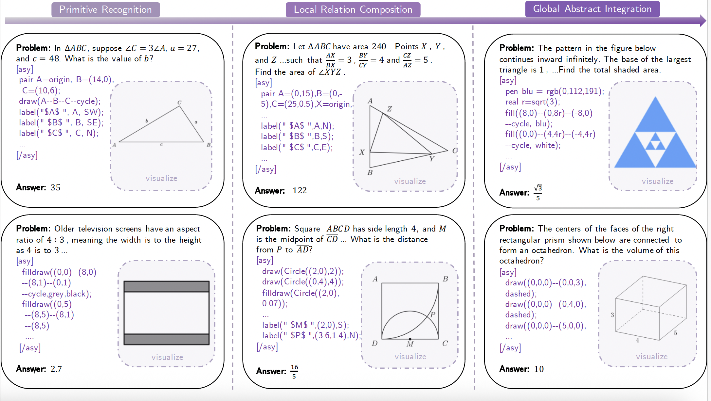

<div align="center">

 # GeoGramBench

<div>
GeoGramBench: Benchmarking the Geometric Program Reasoning  in Modern LLMs
</div>
</div>

<p align="center">
  🤗<a href="https://huggingface.co/datasets/LiAuto-DSR/GeoGramBench" target="_blank">Dataset</a>
</p>

We adopt the <a href="https://github.com/agentica-project/rllm/tree/deepscaler" target="_blank">DeepScaler</a> framework for evaluation, which provides a convenient and efficient evaluating pipeline. 

## Overview
Geometric spatial reasoning forms the foundation of many applications in artificial intelligence, yet the ability of large language models (LLMs) to operate over geometric information expressed in procedural code remains underexplored. In this paper, we address this gap by formalizing the \texttt{Program-to-Geometry} task, which challenges models to translate procedural drawing code into accurate and abstract geometric reasoning. To evaluate this capability, we present \textbf{GeoGramBench}, a benchmark of 500 carefully refined problems organized by a tailored three-level taxonomy that considers geometric complexity rather than traditional mathematical reasoning complexity. Our comprehensive evaluation of 17 frontier LLMs reveals consistent and pronounced deficiencies: even the most advanced models achieve less than 50\% accuracy at the highest abstraction level. These results highlight the unique challenges posed by program-driven spatial reasoning and establish GeoGramBench as a valuable resource for advancing research in symbolic-to-spatial geometric reasoning.

## Datasets

We release our datasets through Hugging Face 🤗:

| Dataset | Description                           | Size | Link                                           |
| ------- | ------------------------------------- | ---- | ---------------------------------------------- |
| GeoGramBench | 500 problems organized by a three-level taxonomy | 500  | [🤗](https://huggingface.co/datasets/GAIR/LIMO) |

## Taxonomy
We propose a taxonomy whose primary principle is the construction of increasingly complex mathematical geometric diagrams from code.
<strong>Primitive Recognition</strong>: Problems involving procedural code that specify only one or two geometric primitives (e.g., points, lines, arcs, circles, polygons), focusing on basic mathematical properties such as length, area, or angle.
<strong>Local Relation Composition</strong>: Problems with multiple local geometric elements, requiring the recognition, integration, and composition of spatial relationships among sub-components of the diagram.
<strong>Global Abstract Integration</strong>: Items demanding spatial direction, parameterization, recursion, 3D objects, composite structures, or advanced geometric operations (e.g., rotation, folding, projection), thus requiring not only the construction of complex diagrams but also global and stepwise spatial reasoning across the entire configuration.




## Getting Started
### Installation
Set up Deepscaler following their official [documentation](https://github.com/agentica-project/rllm/tree/deepscaler).
```bash
# Recommend Python 3.10.
cd deepscaler
pip install -e ./verl
pip install -e .
```
### Data
Our raw testing data in `deepscaler/data/test/GeoGramBench.json`, along with preprocessing scripts. To convert the raw data into Parquet files for training, run:
```python
# Output parquet files in data/*.parquet.
python scripts/data/deepscaler_dataset.py
```

## Evaluation
Our evaluation scripts automatically runs vLLM to generate 8 samples for each problem. To run our evaluation scripts, run:
```bash
#-----------
MODEL_PATH=[CHECKPOINT_PATH]
OUTPUT_DIR=[OUTPUT_DIR]

##----------
export VLLM_ATTENTION_BACKEND=XFORMERS

DATATYPES=("math")
TASKTYPES=("math")

length=${#DATATYPES[@]}
for ((i=0; i<length; i++)); do
    python3 -m verl.trainer.main_generation \
        trainer.nnodes=1 \
        trainer.n_gpus_per_node=8 \
        data.path=./data/${DATATYPES[i]}.parquet \
    	data.data_source_key=${TASKTYPES[i]} \
        data.output_path=${OUTPUT_DIR}/${DATATYPES[i]}.parquet \
        data.n_samples=8 \
        data.batch_size=128 \
        model.path=${MODEL_PATH} \
        rollout.temperature=0.6 \
        rollout.response_length=31000 \
        rollout.top_k=-1 \
        rollout.top_p=0.95 \
        rollout.gpu_memory_utilization=0.9 \
        rollout.tensor_model_parallel_size=8
done
```

We evaluate a total of 17 mainstream large language models (LLMs), spanning both proprietary API and leading open-source systems. The closed-source models include GPT-4o, GPT-o3-mini, the GPT-o1 series, and Gemini-Pro-1.5. The open-source models cover a wide range of scales, including DeepSeek-R1, DeepSeek-v3-0324, and QwQ-32B, as well as other prominent models from 32B down to 1.5B parameters: DeepSeek-R1-distillation variants, Bespoke-Stratos-32B, s1.1-32B, LIMO-32B, Sky-T1-mini-7B, and DeepScaleR-1.5B-preview. And we report Pass@1 accuracy averaged over 8 samples for each problem.

| Model | Primitive | Compositional | Abstract | ALL |
|-------|-----------|-----------|-----------|--------------|
| <strong>Closed-source Models</strong> |
| GPT-o3-mini | 84.33 | 75.66 | 42.16 | 70.00 |
| GPT-o1 | <strong>86.76</strong> | <strong>76.02</strong> | <strong>43.35</strong> | <strong>70.92</strong> |
| GPT-o1-preview | 74.79 | 55.98 | 26.20 | 53.15 |
| GPT-o1-mini | 79.62 | 63.21 | 29.09 | 58.94 |
| GPT-4o | 39.81 | 21.29 | 4.96 | 21.40 |
| Gemini-Pro-1.5 | 49.26 | 31.79 | 15.92 | 31.64 |
| <strong>Open-source Models</strong> |
| DeepSeek-R1 | <strong>85.66</strong> | <strong>75.27</strong> | <strong>40.38</strong> | <strong>69.17</strong> |
| DeepSeek-v3-0324 | 80.57 | 68.89 | 27.67 | 62.05 |
| QwQ-32B | 85.17 | 73.12 | 37.92 | 67.20 |
| DeepSeek-R1-Distill-Qwen-32B | 79.78 | 67.83 | 35.92 | 62.68 |
| Bespoke-Stratos-32B | 62.50 | 42.56 | 17.02 | 40.55 |
| s1.1-32B | 75.37 | 58.96 | 26.58 | 54.60 |
| LIMO-32B | 76.59 | 59.63 | 25.53 | 54.98 |
| DeepSeek-R1-Distill-Qwen-7B | 72.79 | 58.74 | 24.16 | 53.38 |
| Sky-T1-mini-7B | 71.45 | 57.75 | 24.79 | 52.70 |
| DeepSeek-R1-Distill-Qwen-1.5B | 60.29 | 39.02 | 11.03 | 36.70 |
| DeepScaleR-1.5B-preview | 65.44 | 47.89 | 15.76 | 43.83 |